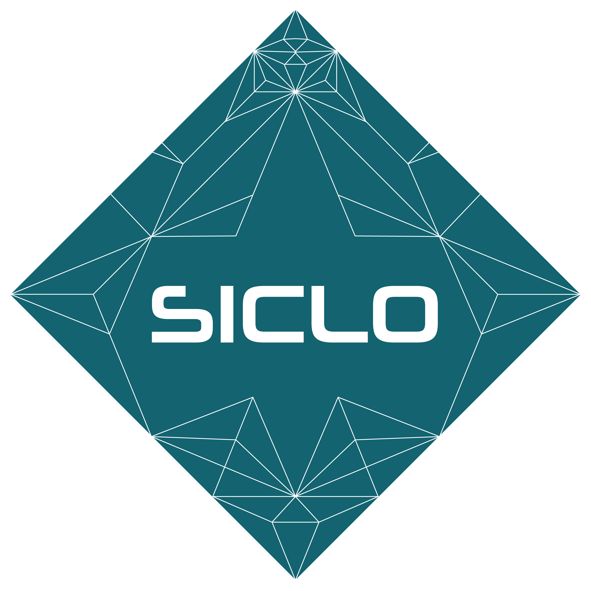
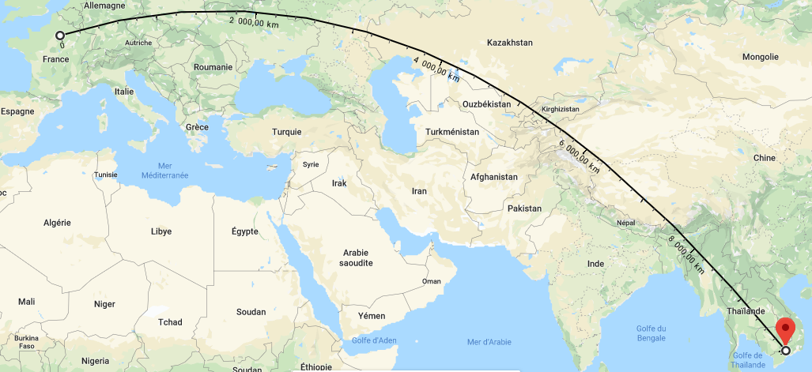
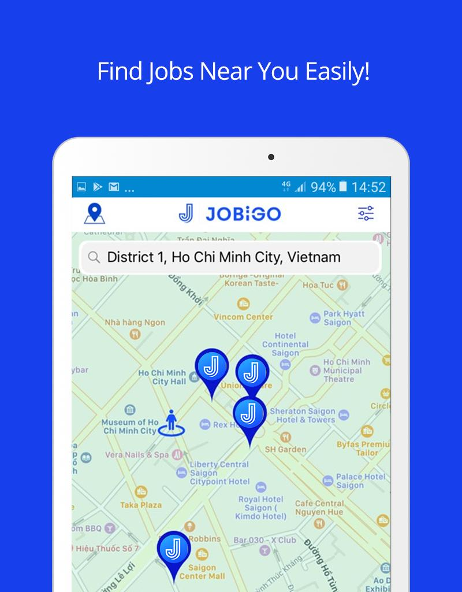
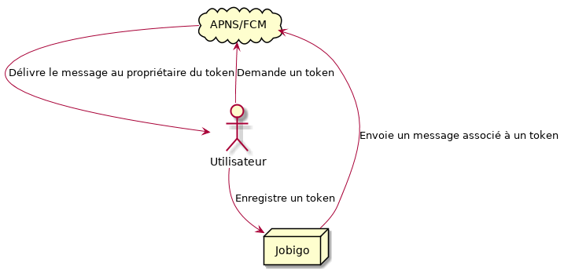
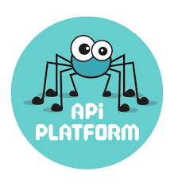
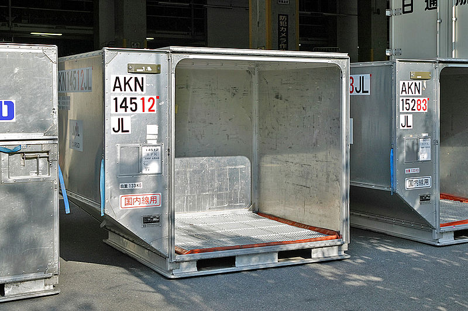
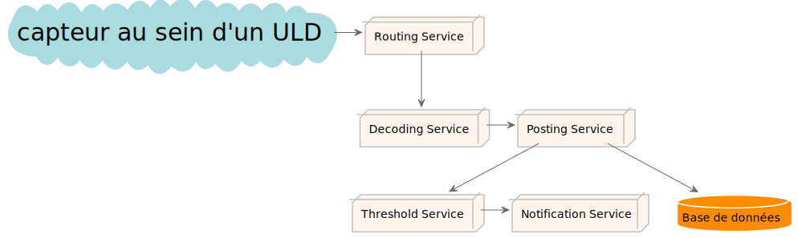

# Siclo Mobile

## L'entreprise

{width=400px}

::: notes
+ Studio de developpement
+ une dizaine de personne
+ fondée par deux ingénieurs français
:::

##  Localisation

::: notes
 + financièrement c'est intéressant
 + culturellement aussi
:::

## Siclo ? Xích lô !

{height=400}

# Jobigo

## Principe
::::::{.columns}
:::{.column width="50%"}
{width=500}
:::
:::{.column width="50%"}
{height=450}
:::
::::::

::: notes

   + aider des chercheurs d'emploi à trouver un emploi

   + faciliter la publication d'offres par les employeurs

   + établir un système de chat

:::

## Participation

{width=450}

::: notes

    + fin de projet
    + notifications

:::

## Type de notifications

::: incremental
+ Offre d'emploi
+ Candidature
+ Acceptation
+ Nouveau message
:::

## Fonctionnement

::: notes
 + deux fournisseurs : APNS et Google
 + expliquer le fonctionnement
  + verifier que l'utilisateur a un token
  + vérifier qu'il est d'accord pour recevoir des notifications
:::

## Technologies 

::::::{.columns}

:::{.column width="30%"}

:::

:::{.column width="50%"}

:::

::::::

# SITA - Smart ULD

##  L'entreprise

::: notes
 + Société Internationale de Télécommunications Aeronautique
 + Formée par toutes les grosses compagnies aeriennes européenes
 + standardisation des télécomunication dans l'aviation
:::

## Projet

{width=600px}

::: notes
 + Capteur dans les uld (Unit Load Device)
 + tracking (temperature, geo, pression, choc)
 + second prix au Cargo Innovation Awards 2019
:::

## Pourquoi ?

::: incremental
 - Prototype non fiable ❌ 
 - Maintenance compliquée ❌ 
:::

::: notes
   1. premier prototype pas très performant en javascript (stagiaire)
   1. flow de données important, argent en jeu
:::

## Principe

{}

::: notes

   + microservices
   + réécriture en typescript
   + système de queue

:::

## Technologies

::::::{.columns}

:::{.column width="33%"}
  
:::

:::{.column width="33%"}
  {height=300px}
:::

:::{.column width="33%"}
  {height=300px}
:::

::::::

## Résultats

::: notes
+ un programme qui fonctionne
+ une architecture plus maintenable
+ un code plus clair
:::

# Mynabes

## Projet

::: notes

+ rapprocher les voisins
+ demander un service
+ faire les courses de quelqu'un d'autre

:::

## Fonctionnement

::: incremental
 + Fonctionnement par voisinnage 📍
 + Fil d'actualité 📰
 + Système de favoris ❤️
 + Discussion instantanée 📱
 + Fonctionnalité de recherche 🔎
:::

## Technologie

# Bilan
    
# Questions ?
