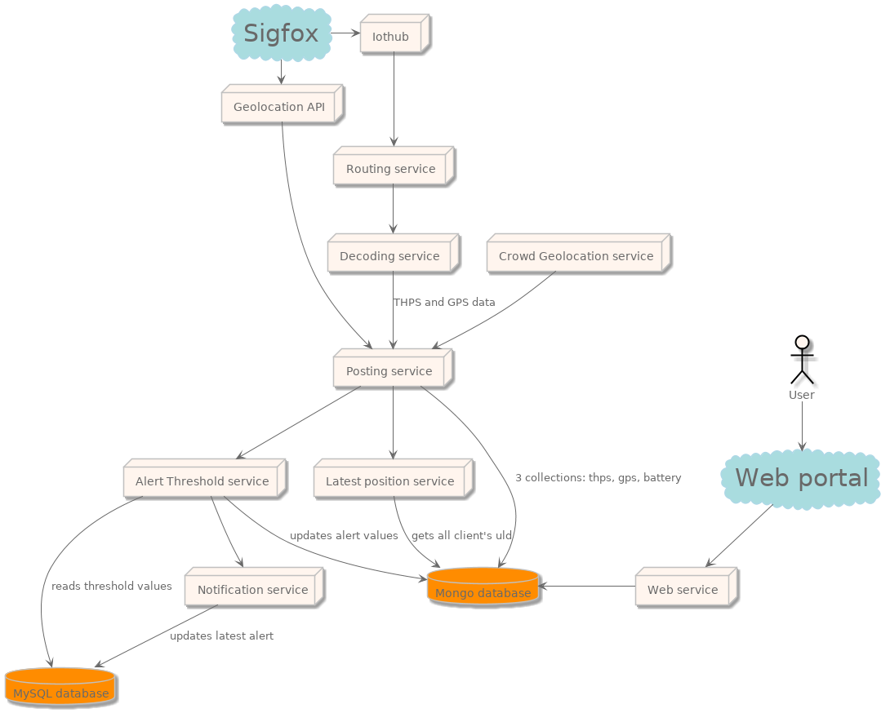

# Siclo Mobile

## L'entreprise

{width=500px}

##  Localisation

# Jobigo

## Principe
::::::{.columns}
:::{.column width="50%"}
{width=500}
:::
:::{.column width="50%"}
{height=450}
:::
::::::

::: notes

   1. aider des chercheurs d'emploie à trouver un emploie

   1. faciliter la publication d'offres par les employeurs

   1. établir un système de chat

:::

## Participation

{width=450}

::: notes

   1. fin de projet
   1. notifications

:::

# SITA - Smart ULD

##  L'entreprise

## Projet

{width=600px}

## Pourquoi ?

::: notes
   1. premier prototype pas très performant en javascript
   1. flow de données important
:::

## Principe
{height=550}

::: notes

   + microservices
   + réécriture en typescript
   + système de queue

:::

## Technologies

::::::{.columns}

:::{.column width="33%"}
  
:::

:::{.column width="33%"}
  {height=300px}
:::

:::{.column width="33%"}
  {height=300px}
:::

::::::

## Résultats

::: notes
+ un programme qui fonctionne
+ une architecture plus maintenable
+ un code plus clair
:::

# mynabes

## Projet

::: notes

+ rapprocher les voisins
+ demander un service
+ faire les courses de quelqu'un d'autre

:::

## conception
   1. front-end
   1. back-end
      1. api

## implémentation
   1. MVC

# Questions ?
